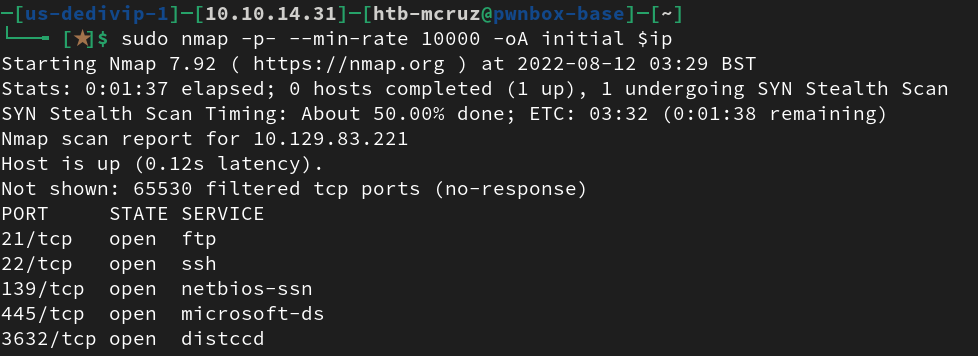

# **Lame writeup for OSCP/PREP by MCRUZ**
### Initial Scan with nmap

``sudo nmap -p- --min-rate 10000 -oA initial $ip``

Now we can run nmap default scripts on each port so we can try to find some useful info.

``sudo nmap -sC -sV -p21,22,139,445,3632 $ip``

Some of the useful information found to take a look are (Anonymous FTP login allowd) so we can try connecting anonymously to the ftp port and dig for users, creds, etc. Also port 139/445 for SMBv 3.X which is a potenial attack surface that is well-known.

In my case i went ahead and scan the SMB ports to see if i can discover some WRITE/READ operations permited on the shares avaible. As shown in the image the **tmp** share has this permissions enabled so we can start from there.

For this purpuse i used the SMB enumeration tool called **smbmap** with the option -H.

